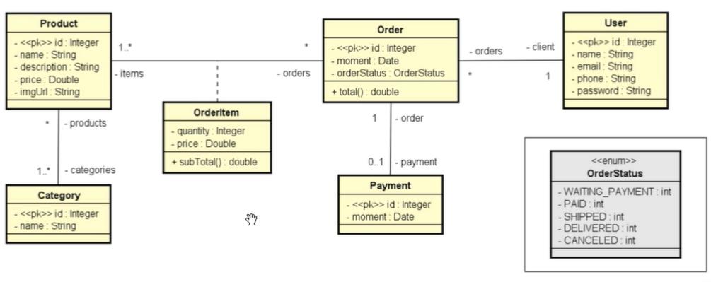

# Sales
 

# Sobre o projeto

Sales é uma API REST desenvolvida com SpringFramework. Essa aplicação esta baseada no diagrama UML abaixo, do curso de Java e Orientação a Objetos (DevSuperior).
Este projeto não está concluido.

## UML - Modelo conceitual

# Tecnologias utilizadas
## Back end
- Java
- Spring Boot
- JPA / Hibernate
- Maven
- Banco de dados H2.

# Autor

William Henrique Campos

https://www.linkedin.com/in/william-henrique-campos-98568813a/
